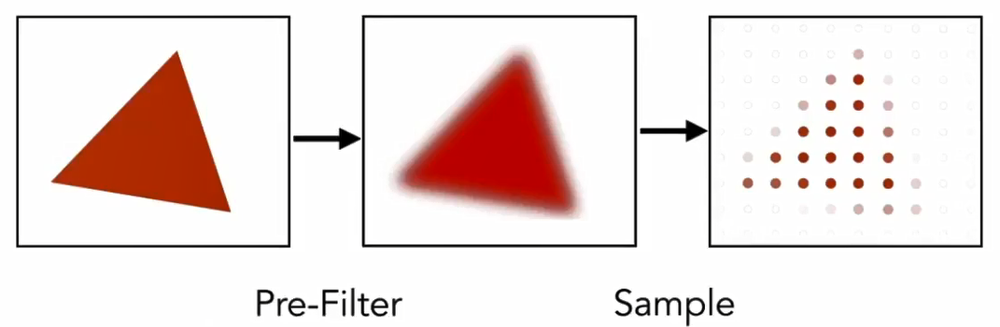
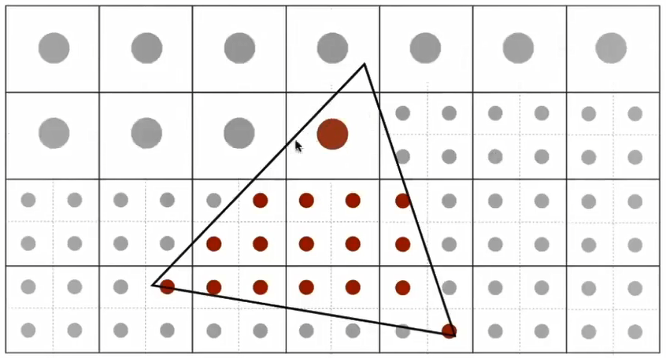
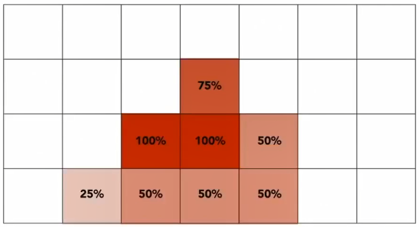
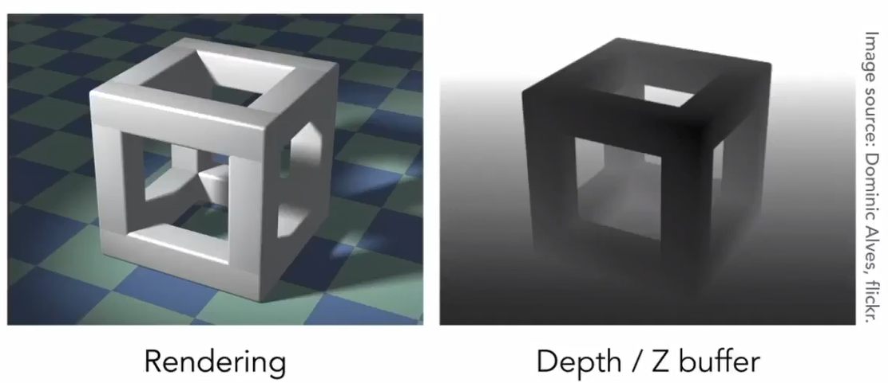

# Viewport transform(视口变换)

What's a screen?

- An array of pixels
- Size of the array: resolution
- A typical kind or raster display

Screen space: Origin at left-bottom
Transform in xy plane: `[-1, 1]x2` to `[0, width) x [0, height)`

```
             | width/2         0  0  width/2  |
M_viewport = |       0  height/2  0  height/2 |
             |       0         0  1         0 |
             |       0         0  0         1 |
```


# Raster triangles

Check every pixels in triangle or not with cross product calculation. If true, paint pixel.

```cpp
// Triangle: ABC
// Point: P
bool insize(P, ABC) {
    return   ((B-A).cross(C-A) * (B-A).cross(P-A) > 0)
          && ((A-B).cross(C-B) * (A-B).cross(P-B) > 0)
          && ((A-C).cross(B-C) * (A-C).cross(P-C) > 0);
}
```


# Anti-Aliasing

Artifacts due to sampling - `Aliasing`:

- Jaggies(锯齿): sampling in space
- Moire Pattern(摩尔纹)
- Wagon wheel effect: sampling in time

Behind the aliasing is that signals are changing too fast(high frequency) but sampled too slowly.

Reduce aliasing error:

- Increase sampling rate: use high resolution screen
- Blurring(pre-filter) before sampling: signals with higher frequencies need faster sampling. So we can filter the high frequency contents.



## MSAA: Multi-Sampling Anti-Aliasing

Approximate the effect of the 1-pixel box filter by sampling multiple locations with a pixel and averaging their values.
We consider one pixel into NxN sub-pixels to calculate the coverage percentage of pixel. Then the final value is original pixel value multiplied the coverage percentage.

- Take then NxN samples in each pixel



- Average the NxN samples "inside" each pixel



## Other anti-aliasing ideas

- FXAA(Fast Approximate Anti-Aliasing): Remove the jaggies edge with perform image processing on aliasing rendered image(使用图像处理方法，移除锯齿边界).
- TAA(Temporal Anti-Aliasing): Use last frames for anti-aliasing operation.
- Super resolution/sampling


# Z-Buffer

Idea: store current min. z-value for each sample(pixel) in the depth buffer(z-buffer).
> Note that we use positive z value here and samller z is closer and larger z is further.

A depth buffer example:



