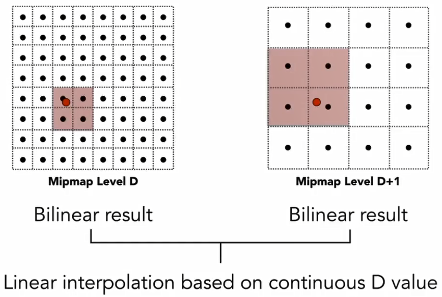

> Shading definition in graphics: the process of applying a material to an object.

# Blinn-Phong relectance model

反射模型用于描述光线如何与材质发生作用。

- Specular highlights(高光，镜面光照)

观察方向与光的反射方向越接近，则可以观察到的高光越明显(即图中的`n`和`h`是否接近)。

- Diffuse reflection(漫反射)

漫反射的反射方向是全范围的，故漫反射的强度与观察方向无关，只与图中的`n`和`l`有关。

- Ambient lighting(环境光)

# Shading frequency

- Flat shading(per triangle shading): Triangle face is flat and all pixel color in triangle is same.
- Gouraud shading(per vectex shading): Interpolate colors from vertices across triangle colors from vertices across triangle.
- Phong shading(per pixel shading): Interpolate normal vectors across each triangle. Compute full shading model at each pixel.

## Defining per-vertex normal vector

Average surrounding face normals as vertex normal vertex(顶点向量通过相关联的三角面的向量求加权平均).

## Defining per-pixel normal vector

Barycentric interpolation of normals of vertex. Properties to interpolate across triangle can be texture coordinate, colors, normal verctors, etc.

**Barycentric coordinate(重心坐标):**

> 注意：投影前后，三角形的重心坐标可能不一样。

# Graphics(real-time rendering) pipeline

Fixed function in GPU + shader program.

# Texture mapping

Surface lives in 3D world space get each color pixel color from 2D image.
Each triangle vertex is assigned a texture coordinate`(u, v)`.

- Minmap: Allowing fast, approximately, square range queries

Pixel of each level minmap, is the range(average or other) value of 4 pixels of upper level(每层Level纹理的一个像素，均为上一层的4个像素的平均值). Minmap can be pre-computed before use.

To compute minmap level D is to find the distance of 2 pixel in texture, which represents the distance of 2 adjacent(相邻的) pixel on screen.

If we need to get the float level, use trilinear interpolation.

- Ripmap: Can loop up aixs-aligned rectangular zones

## Applications of textures

- Environment lighting

Light from the environment and rendering with the environment.
We can alse store environment lighting data into spherical map or cube map.

- Store microgeometry

Bump/Normal mapping(凹凸/法线帧图): change normal vector

Displacement mapping(位移贴图): move the vertices

