Rasterization could not handle global effects well:

- Soft shadows(软阴影)
- Glossy reflection
- Indirect illumination(间接光照)

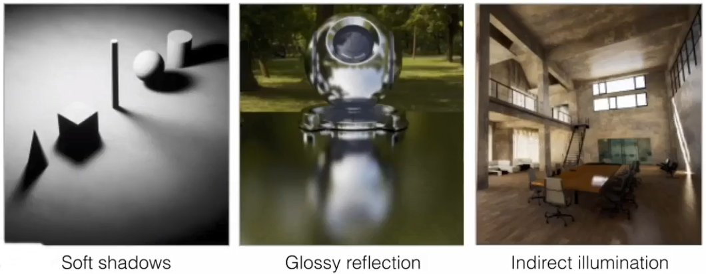

Ray tracing is accurate but is very slow.

***Light rays:***

- Light travels in straight lines
- Light rays do not "collide" with each other if they cross
- Light rays travel from the light sources to the eye(但是光路具有可逆性)

***Recursive (Whitted-Style) Ray Tracing:***

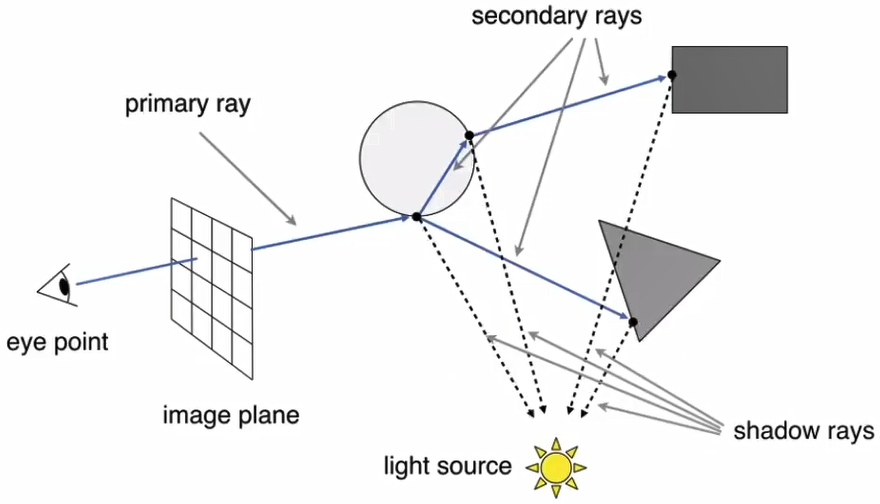


---
# Ray surface intersection

(光线与物体表面的交点计算)

- Ray equation

Ray is define by its origin and a direction vector

$$
r(t) = o + t \cdot \vec{d}, \; t \geq 0
$$

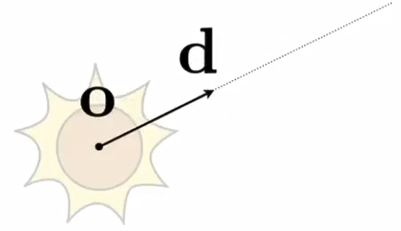

- Ray intersection with sphere

$$
p: \; (p-c)^2 - R^2 = 0
$$

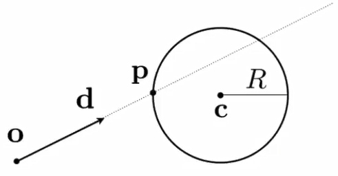

- Ray intersection with triangle

Compute intersection with plane then check if is inside at triangle.

$$
p: (p - p') \cdot \vec{N} = 0
$$

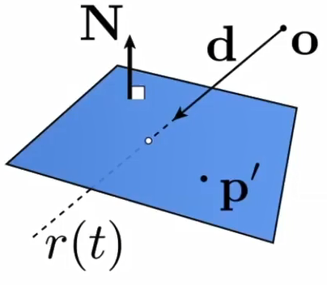


# Accelerating computing intersection

## Bounding volumes

We often use an Axis-Aligned Bounding Box(AABB, 轴对齐包围盒).

Ray intersection with AABB(2D example and 3D is the same):

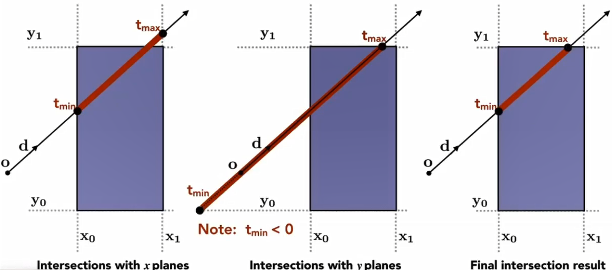

A box(3D) is three pairs of infinitely large slabs(三组无限大正对平面).
- The ray enters the box only when it enters all pairs of slabs
- The ray exits the box as long as it exits any pairs of slabs

Uniform grids

### Ray-Scene intersection

Step through grid in ray traversal order

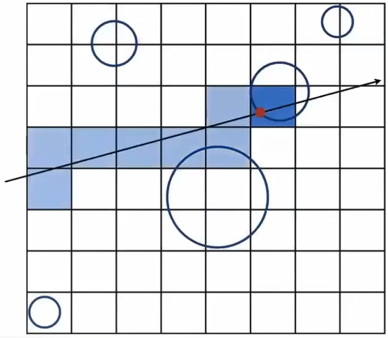

### How to split grids

***Spatial partitions(根据空间划分):*** OCT-Tree, KD-Tree, BSP-Tree

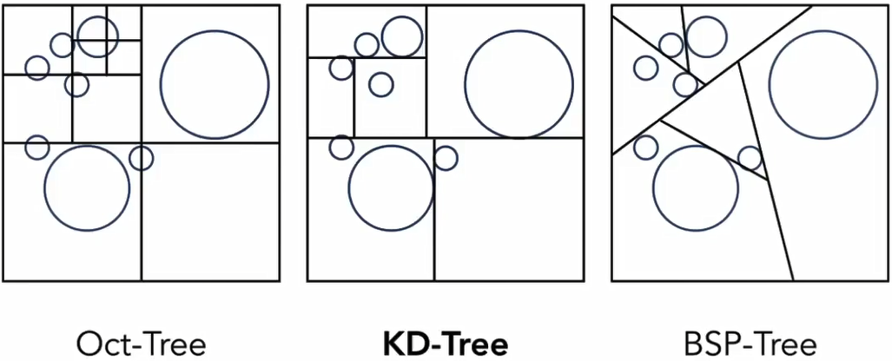

But an object may be contained in multiple grids.

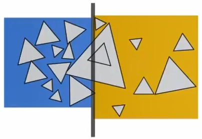

***Object partitions(根据物体划分):*** Bounding Volume Hierarchy(BVH)

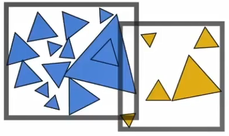


---
# Basic radiometry(辐射度量学)

- **Radient Energy**: the enery of electromagnetic radiation(电磁辐射)

$$
\text{Radient Energy} = Q,
\text{unit:} J
$$

- **Radient Flux**: the enery emitted, reflected, transmitted or received per unit time(单位时间的能量，即功率).

$$
\text{Radient Flux} = \Phi = \cfrac{dQ}{dt},
\text{unit:} W
$$

- **Radiant Intensity**: the radiant(luminous) intensity is the power per unit *solid angle* emitted by a point light source.

$$
I(\omega) = \cfrac{d\Phi}{d\omega}
$$

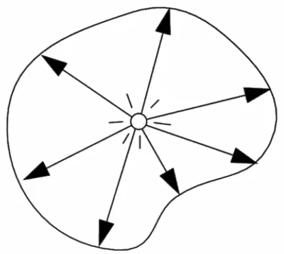

What's *Solid angle(立体角)*:

$$
\Omega = \cfrac{A}{r^2}, \;
\text{unit:} \; steradians \\
\Omega_{sphere} = 4 \pi \; steradians
$$

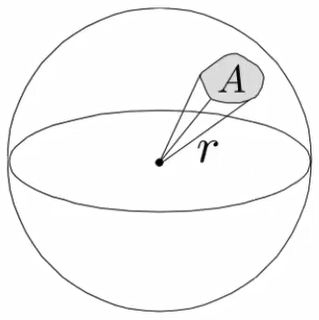

What's *Differential Solid Angle(单位立体角)*:

$$
d\omega = \cfrac{dA}{r^2} = sin \theta \cdot d \theta \cdot d \phi
$$

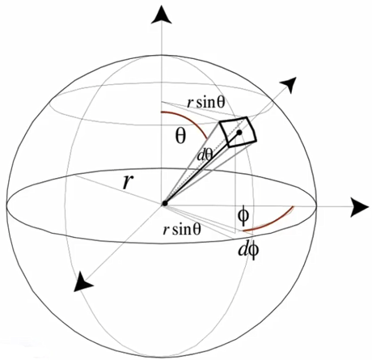

- **Irradiance**: the power per unit(perpendicular or projected, 垂直或投影区域) area.

$$
E(x) = \cfrac{d\Phi(x)}{dA}
$$

What's *Irradiance Falloff(衰减)*:

$$
E = \cfrac{\Phi}{4\pi r^2}
$$

- **Radiance**: power emitted, reflected, transmitted or received by a surface, per unit solid angle, per projected unit area (单位面积在单位立体角上辐射的能量，即Radient Energy).

> 或理解成：一个面在单位立体角上辐射的Irradiance
>
> 或理解成：一个立体角在单位面积上辐射的Radiant Intensity

$$
L(p, \omega) = \cfrac{ d^2 \Phi (p, \omega) }{ d\omega \cdot dA \cdot cos \theta }
\\[2ex]
L(p, \omega) = \cfrac{ d E (p, \omega) }{ d\omega \cdot cos \theta }
\\[2ex]
L(p, \omega) = \cfrac{ d I (p, \omega) }{ dA \cdot cos \theta }
$$

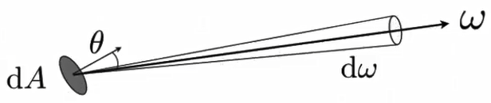

## Irradiance vs. Radiance

**Irradiance**: total power received by area $dA$

**Radiance**: power received by area $dA$ from `direction` $d\omega$

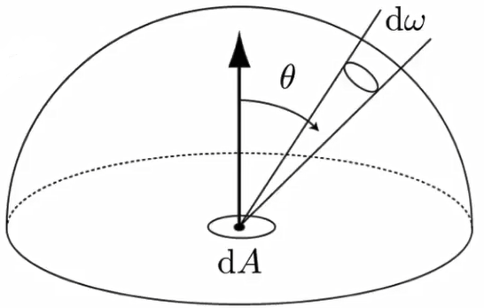


| Concept               | Symbol                               |
| :-                    | :-                                   |
| Radient **Energy**    | $Q$                                  |
| Radient **Flux**      | $\Phi = \cfrac{dQ}{dt}$              |
| Radiant **Intensity** | $I(\omega) = \cfrac{d\Phi}{d\omega}$ |
| **Irradiance**        | $E(x) = \cfrac{d\Phi(x)}{dA}$        |
| **Radiance**          | $L(p, \omega) = \cfrac{ d^2 \Phi (p, \omega) }{ d\omega \cdot dA \cdot cos \theta } \\[2ex] L(p, \omega) = \cfrac{ d E (p, \omega) }{ d\omega \cdot cos \theta } \\[2ex] L(p, \omega) = \cfrac{ d I (p, \omega) }{ dA \cdot cos \theta }$ |

## Bidirectional Reflectance Distribution Function(BRDF)

> 双向（可逆）反射分布函数

### Reflection at a point

Radiance from direction $\omega_i$ turns into the power $E$ that $dA$ receives.
Then power $E$ will become the radiance to any other direction $\omega_r$.

Differential irradiance incoming: $dE(\omega_i) = L(\omega_i) cos \theta_i \cdot d\omega_i$

Differential radiance outputing: $dL_r(\omega_r)$

> 能量从某个方向进来，反射到某个方向去

The BRDF equation:

$$
f_r(\omega_i \rightarrow \omega_r) = \cfrac{dL_r(\omega_r)}{dE_i(\omega_i)}
$$

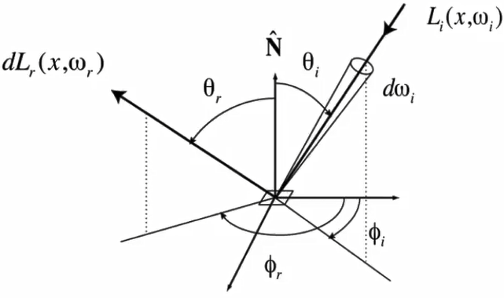

### Reflection equation

Looking at $p$ from direction $\omega_r$ is the integral of $L_i$ multiplied with $f_r$ in all direction $\omega_i$.
> 从方向$\omega_r$看向着色点$p$，即是所有方向$\omega_i$上，对$L_i$乘上$f_r$的积分。

$$
L_r(p, \omega_r) = \int_{H^2} f_r(p, \omega_i \rightarrow \omega_r) L_i(p, \omega_i) cos \theta_i \cdot d\omega_i
$$

Here $H^2$ is unit hemisphere(单位半圆).

### Rendering equation

Adding an emission term(本身发光的部分).

$$
L_o(p, \omega_o) = L_e(p, \omega_o) + \int_{H^2} L_i(p, \omega_i) f_r(p, \omega_i \rightarrow \omega_o) (\vec{n} \cdot \omega_i) \cdot d\omega_i
$$

Here $H^2$ is unit hemisphere(单位半圆).

> $\vec{n} \cdot \omega_i$ is normal vector multiplied with $\omega_i$ which is just $cos \theta_i$.

***Linear operator equation***:

$$
l(u) = e(u) + \int l(v) K(u, v) dv
$$
$$
\begin{aligned}
\textcolor{blue}{L} &= E + K \textcolor{blue}{L} \\
I\textcolor{blue}{L} - K \textcolor{blue}{L} &= E \\
(I-K)\textcolor{blue}{L} &= E \\
\textcolor{blue}{L} &= (I-K)^{-1}E \\
&\text{Binomial Theorem} \\
\textcolor{blue}{L} &= (I + K + K^2 + K^3 + ...)E \\
\textcolor{blue}{L} &= E + KE + K^2E + K^3E + ...
\end{aligned}
$$


---
# Probability overview

$X$: Random variable that represents a distribution of potential values.

$X \sim p(x)$: probability density function (PDF, 概率密度函数).

$X$ drawn from distribution with n discrete values $x_i$ with probabilities $p_i$.
The expected value of $X$:

$$
E[X] = \sum_{i=1}^{n} x_i \cdot p_i
$$

For continuous case: probability distribution function(PDF, 概率分布函数)

$$
E[X] = \int x \cdot p(x) \cdot dx
$$


---
# Monte Carlo integration(蒙特卡洛积分)


Define integral:

$$
\int_{a}^{b} f(x)dx
$$

Random variable(在积分域上采样的概率分布):

$$
X_i \sim p(x) = \cfrac{1}{b-a}
$$

Monte Carlo estimator:

$$
\begin{aligned}
F_N
&= \cfrac{1}{N} \sum_{i-1}^{N} \cfrac {f(X_i)} {p(X_i)} \\[1ex]
&= \cfrac{b-a}{N} \sum_{i=1}^{N} f(X_i)
\end{aligned}
$$

Monte Carlo integration:

$$
\int_{a}^{b} f(x)dx = \cfrac{1}{N} \sum_{i-1}^{N} \cfrac {f(X_i)} {p(X_i)},
\;
X_i \sim p(x)
$$

> 求一个定积分，只需要在积分域以概率分布函数$p(X_i)$采样，然后对样本值计算$f(X_i)$除以$p(X_i)$的值，最后求平均


---
# Path tracing

Calculate definite integral(定积分) with Monte Carlo:

$$
\begin{aligned}
L_o(p, \omega_o)
&= \int_{H^2} L_i(p, \omega_i) f_r(p, \omega_i \rightarrow \omega_o) (\vec{n} \cdot \omega_i) \cdot d\omega_i
\\[1ex]
&\approx \cfrac{1}{N} \sum_{i=1}^{N} \cfrac {L_i(p, \omega_i) f_r(p, \omega_i \rightarrow \omega_o) (\vec{n} \cdot \omega_i)} {pdf(\omega_i)}
\\[1ex]
pdf(\omega_i) &= \cfrac{1}{2\pi}
\end{aligned}
$$

The pseudocode at python style:

```py
def shade(p, wo):
    if random() > P_RR return 0.0
    Lo = 0.0
    # Use N=1 for only ONE direction to avoid explosion of rays(光线指数爆炸)
    for wi in random(1, pdf):
        r = ray_trace(p, wi)
        if ray_hit(r, light):
            # ray `r` hit the light
            Lo = Li * fr * cos / pdf(wi) / P_RR
        elif ray_hit(r, obj, q):
            # ray `r` hit the an object at q
            Lo = shade(q, -wi) * fr * cos / pdf(wi) / P_RR
    return Lo

def ray_generation(campos, pixel):
    pixel_radiance = 0.0
    # Trace multiple paths through each pixel and average their radiance
    for spl in sample(N, pixel):
        r = ray_shoot(campos, cam_to_spl)
        if ray_hit(r, scene, p):
            pixel_radiance += (1 / N) * shade(p, cam_to_spl)
    return pixel_radiance
```

And shoot ray with probability P_RR = $P$:

- With probability $P$, shoot a ray and return $\cfrac{L_o}{P}$
- With probability $1-P$, do NOT shoot a ray and return $0$

And the expected value:

$$
E(L_o) = P \cdot \cfrac{L_o}{P} + (1 - P) \cdot 0 = L_o
$$

## Sampling the light

For a more efficient path tracing, sampling the light directly:

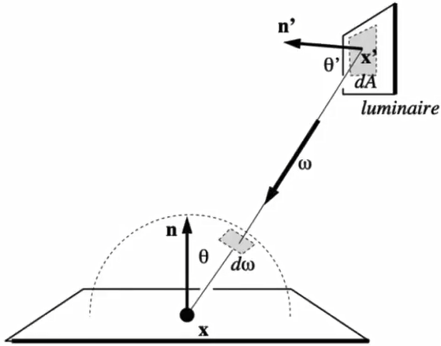

Project area on the uint sphere:

$$
d\omega = \cfrac {dA \cdot cos \theta '} { || x' - x || ^2}
$$

Then we have:

$$
\begin{aligned}
L_o(p, \omega_o)
&= \int_{H^2} L_i(p, \omega_i) f_r(p, \omega_i \rightarrow \omega_o) (cos \theta) \cdot d\omega_i
\\[1ex]
&= \int_{H^2} L_i(p, \omega_i) f_r(p, \omega_i \rightarrow \omega_o) (\cfrac {dA \cdot cos \theta '} { || x' - x || ^2}) \cdot d\omega_i
\end{aligned}
$$

Final we consider the radiance coming from two parts:

1. light source (direct, no need to have P_RR)
2. other reflectors (indirect, need P_RR)

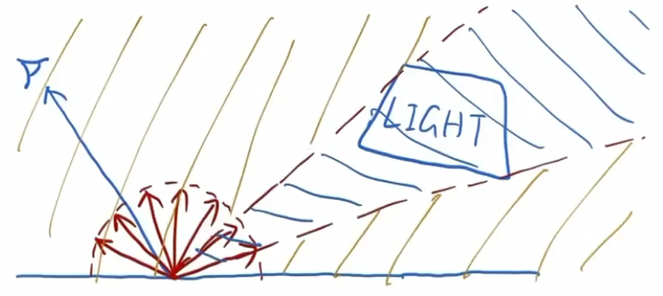

```py
def shade(p, wo):
    # Contribution from the light source
    pdf = 1 / A
    x` = sample(light, pdf)
    L_dir = Li * fr * cos(θ) * cos(θ`) / |x` - p|^2 / pdf

    # Contribution from other reflectors
    pdf = 1 / 2pi
    wi = sample(hemisphere, pdf)
    L_indir = 0.0
    if random() < P_RR:
        r = ray_trace(p, wi)
        # ray `r` hit the an non-emitting object at q
        if ray_hit(r, non_emitting_obj, q):
            L_indir = shade(q, -wi) * fr * cos(θ) / pdf / P_RR

    return L_dir + L_indir
```

