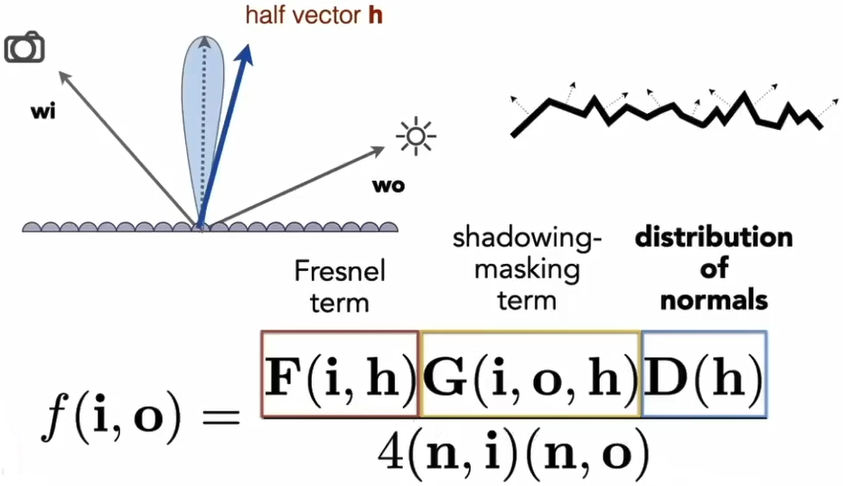

>What is material in compute graphics?
>
> Material = BRDF

---
# Diffuse(漫反射) material

$$
\begin{aligned}
L_o(\omega_o)
&= \int_{H^2} f_r L_i(\omega_i) cos \theta_{i} \cdot d\omega_i
\\[1ex]
&= f_r L_i \int_{H^2} \sout{(\omega_i)} cos \theta_{i} \cdot d\omega_i
\\[1ex]
&= \pi f_r L_i
\end{aligned}
$$

> 假定：入射光radiance和出射光的radiance是均匀分布(uniform)的；
> 对材质的某个点，不发光，也不吸收光，因为能量守恒，则有$L_o(\omega_o)=L_i(\omega_i)$

Define albedo(漫反射系数):

$$
f_r = \cfrac{\rho}{\pi}
$$

---
# Glossy material

> 光滑材质（但不是完全光滑，不如镜面光滑），例如：抛光金属

---
# Ideal reflective/refractive material

## Perfect specular reflection(完全镜面反射)

> $\phi$ is azimuthal(方位角) angle

$
\omega_o = -\omega_i + 2(\omega_i \cdot \vec{n}) \cdot \vec{n}
$

## Specular refraction(折射)

> $\phi$ is azimuthal(方位角) angle

$
\eta_i sin \theta_i = \eta_t sin \theta_t
$

---
# Microfacet(微表面) material

- macroscale(宏观表面): flat & rough
- microscale(微观表面): bumpy(崎岖不平的) & specular

> 从远处看，是材质外观；从近处看，是几何外观。

Each individual element of surfaces acts like mirrors, called microfacet, has its own normal.

> 每个微表面均有自己的法向量。

## Microfacet(微表面) BRDF

Key is the distribution of microfacet's normals:

- Normals is concentrated: glossy
- Normals is spread: diffuse

And calculation of microfacet BRDF:

---
# Isotropic(各向同性的)/Anisotropic(各向异性的) materials

Key is the directionality of underlying surface:

---
# Properties of BRDF:

- Non-negativity:

$$
f_r(\omega_i \rightarrow \omega_r) \geq 0
$$

- Linearity:

$$
L_r(p, \omega_r) = \int_{H^2} f_r(p, \omega_i \rightarrow \omega_r) L_i(p, \omega_i) cos \theta_i \cdot d\omega_i
$$

- Reciprocity principle(可逆性):

$$
f_r(\omega_r \rightarrow \omega_i) = f_r(\omega_i \rightarrow \omega_r)0
$$

- Energy conservation(能量守恒):

$$
\forall \omega_r \int_{H^2} f_r(\omega_i \rightarrow \omega_r) cos \theta_i \cdot d\omega_i \leq 1
$$

- Isotropic and anisotropic: 
  - If isotropic: $f_r(\theta_i, \phi_i; \theta_r, \phi_r) = f_r(\theta_i, \theta_r, \phi_r - \phi_i)$
  - If anisotropic: $f_r(\theta_i, \phi_i; \theta_r, \phi_r) \neq f_r(\theta_i, \theta_r, \phi_r - \phi_i)$

