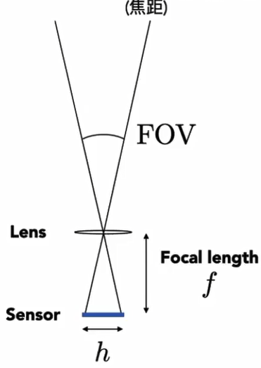
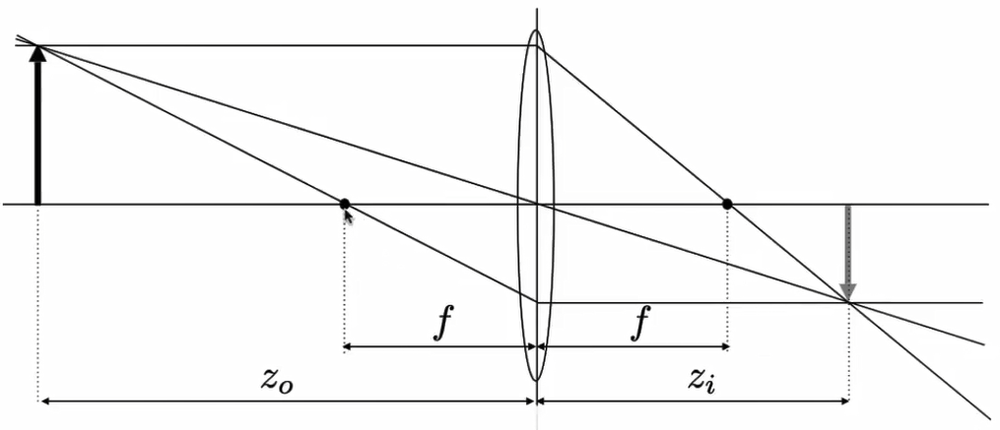

---
# Camera

- Pinhole camera(针孔相机)

## Field of View(FOV)

## Exposure(曝光时间)

- H = T x E

Exposure = time x irradiance

T = exposure time 

E = irradiance

## Aperture size(光圈大小)

Change the f-stop by opening/closing the aperture.

## Shutter speed

Change the duration of the sensor pixels integrate light.

## ISO gain(感光度)

Change the amplification between sensor values and digital image values.

---
# Thin lens approximation

Then thin lens equation:

$$
\cfrac{1}{f} = \cfrac{1}{z_i} + \cfrac{1}{z_o}
$$

## Defocus blur

- Computing circle of confusion(CoC) size

- Depth of Field(FYI, 景深) 

---
# Light Field / Lumigraph

- (光场)

- Light Field Camera

