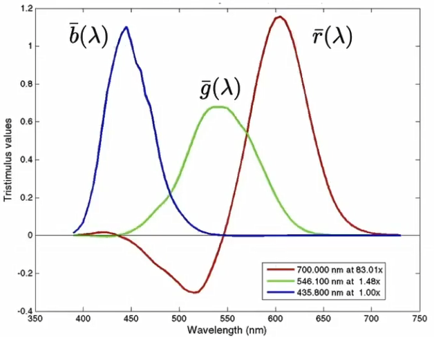
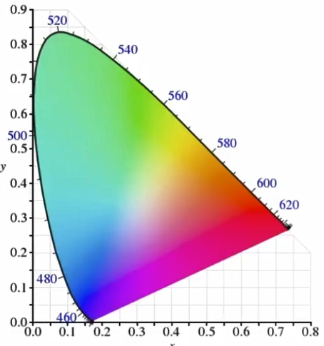

## Physical basis

- Visible spectrum of light

- Spectral power distribution(SPD)

## Spectral response of human cone cells

Color is a phenomenon of human perception.

- Additive color(加色系统)

## Color space

- CIE RGB color matching functions

- CIE chromaticity(色域)

- Standardized RGB(sRGB)

- HSV color space(Hue-Saturation-Value)

- CIELAB space

- CMYK: A subtractive color space(CMYK减色系统)

